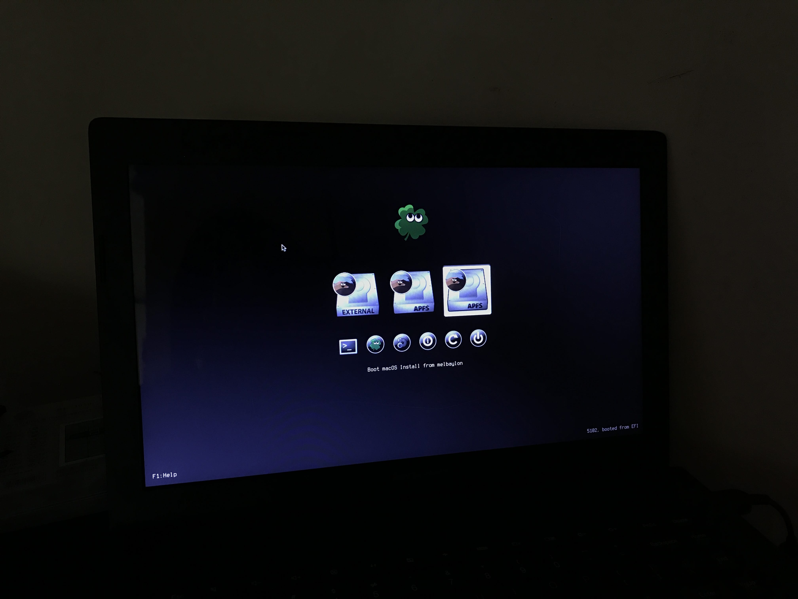

# 2021-01-02 first install pass

Trying to install macOS Mojave using
- [UniBeast 9.3.0 - Mojave](https://www.tonymacx86.com/resources/unibeast-9-3-0-mojave.449/)
- [MultiBeast 11.3.0 - Mojave](https://www.tonymacx86.com/resources/multibeast-11-3-0-mojave.430/)

## Installation experience
### Booting into macOS Mojave USB installer
- trackpad doesn't work on boot to the installer
- internal keyboard also doesn't work

### Booting into installed macOS Mojave after install

- macOS continues to the installation after reboot
  - pretty slow compared to when installing macOS on an MacBook Pro
  - reboots after this
  - continue setup (interl trackpad and keyboard not working)
  -  chose to not connect to the at this time
### Installing drivers
-  set up Multibeast
   -  NOTE: can't recall what options I choose, will need to revisit this
- Keyboard, trackpad and wifi doesn't work

## Steps taken
- Erase installation drive using Disk Utility
  - Format: APFS
  - Scheme: GUID Partition Map
- Change date to install Mojave in 2021 (make sure to not be connected to the Internet)
  - run 'date 1116211618' on Terminal
- Install macOS Mojave as you normally do
- Reboots a few times like a normal macOS Mojave installation
- And done!

# 2021-01-03 What works and what doesn't (essentials)

I define essentials as the list of things that will fulfill my use case for this hackintosh. This build is to serve as a secondary Mac that will have the essential software packages, configurations and files so I can quickly switch to using it if something bad happens to my main machine. That said, this build's state fully fulfills that need. Though primarily I would also like to make the internal Wi-Fi working and brightness control working for convenience.

## Works
- Internal keyboard (voodoo)
- Internal trackpad (voodoo)
- Audio and controls (voodoo)
- Ethernet
- External D-Link USB wireless adapter ([Wireless-USB-Adapter](https://github.com/chris1111/Wireless-USB-Adapter))

## Doesn't work
- Brightness control
- SD card reader
- Internal Wi-Fi card
- Bluetooh (but might be a hardware problem)

# 2021-01-03 things to try to get working
- Internal Wi-Fi
- Brightness Control

# 2021-01-03 clover update fail
I updated clover using clover configurator, restarted and the internal keyboard and internal trackpad, and USB input devices stopped working. 😅

Desktop sharing was disable so I couldn't VNC into the hackintosh. Fortunately, I had ssh access enabled. First, I tried https://github.com/BlueM/cliclick to send key presses to the hackintosh and hopefully load and reinstall my previous working config using Multibeast. It didn't work or at least I gave up due to the complexity. Then I wondered if I can enable VNC via the command line while logged in via SSH. [It turned out that I can.](https://www.techrepublic.com/article/how-to-enable-screen-sharing-on-macs-via-terminal/)

# 2021-01-04 can't control fan
I became aware that the G400's fan is not detected. Thus the CPU throttle's down when it reaches certain temperatures. The laptop is also pretty hot because of this.